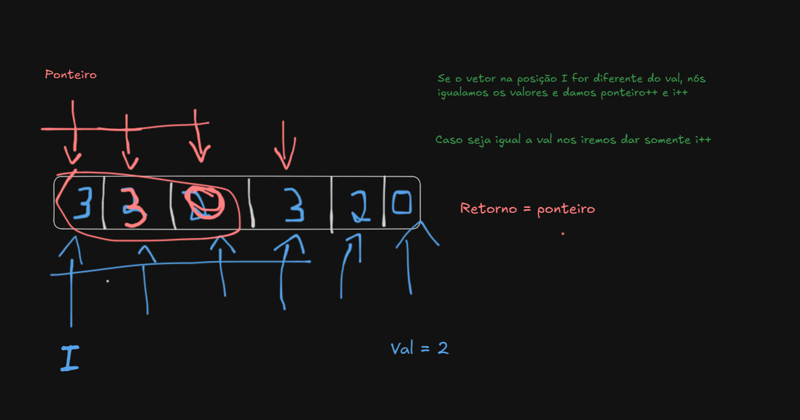

# Intuition
Criar um solução usando ponteiro


# Approach
O ponteiro vai indicar o lugar que é para colocar o valor != do value e o i vai ir iterando e comparando todos os valores. Caso seja = ele so pula, caso seja diferente colocamos o valor da posição i no lugar da posição ponteiro e atualizamos o ponteiro++ e i++

# Complexity
- Time complexity: O(n)

- Space complexity:O(1)

# Code
```csharp []
public class Solution {
    public int RemoveElement(int[] nums, int val) {
        

        //sempre tem um numero para ser removido?
        //tem que estar em ordem no final?
        //o array sempre vem com um valor?

        //eu crio um ponteiro n = 0
        //inicio um for loop
        //caso o numero na posicao i do for == k
        //eu oloco n++
        //fora da condicao if eu coloco [i] == [n]
        //retorno n


        // int ponteiro = 0;
        // for(int i=0;i<nums.Length;i++){
        //     if(nums[i] != val){
        //         nums[ponteiro]=nums[i];
        //         ponteiro++;
        //     }
        // }

        // return ponteiro;

        //i create a pointer = 0 
        //i create a for loop  
        //i will check if the value = number inside the drawer

        // int pointer = 0;
        
        // for(int i = 0;i< nums.Length;i++){
            
        //     if(nums[i]!=val){
        //         nums[pointer]= nums[i];
        //         pointer = pointer+1; 
        //     }
        // }

        // return pointer;


        //Revisão:

        //Create a pointer caled "pointer"
        //Create a for loop starting in 0
        //Compare the values
        //If it is not equal to val, we set the value at position "pointer" equal to the value at position i
        //Else we just i++
        //Time = O(n)
        //Space = O(1)

        int pointer = 0;
        for(int i = 0;i<nums.Length;i++){
            if(nums[i] != val){
                nums[pointer] = nums[i];
                pointer++;
            }
        }

        return pointer;
    }
}
```
