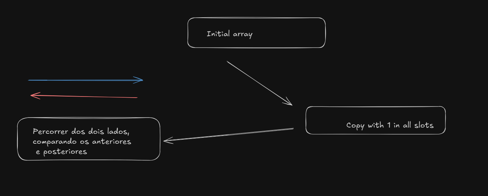

# Intuition
Usar ponteiros para solucionar

# Approach
Criei um array com numeros 1, e percorri indo e voltando o array de ratings, para o final ter o valor de cada slot.


# Complexity
- Time complexity:
O(n)

- Space complexity:
O(n)

# Code
```csharp []
public class Solution {
    public int Candy(int[] ratings) {

        int n = ratings.Length;
        int[] candies = new int[n];
        Array.Fill(candies, 1);

        for (int i = 1; i < n; i++) {
            if (ratings[i] > ratings[i - 1]) {
                candies[i] = candies[i - 1] + 1;
            }
        }

        for (int i = n - 2; i >= 0; i--) {
            if (ratings[i] > ratings[i + 1]) {
                candies[i] = Math.Max(candies[i], candies[i + 1] + 1);
            }
        }

        int totalCandies = 0;
        foreach (int candy in candies) {
            totalCandies += candy;
        }

        return totalCandies;   
    }
}
```
